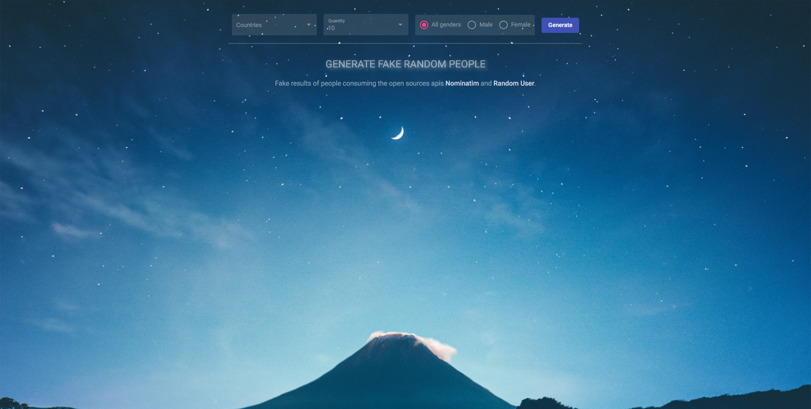
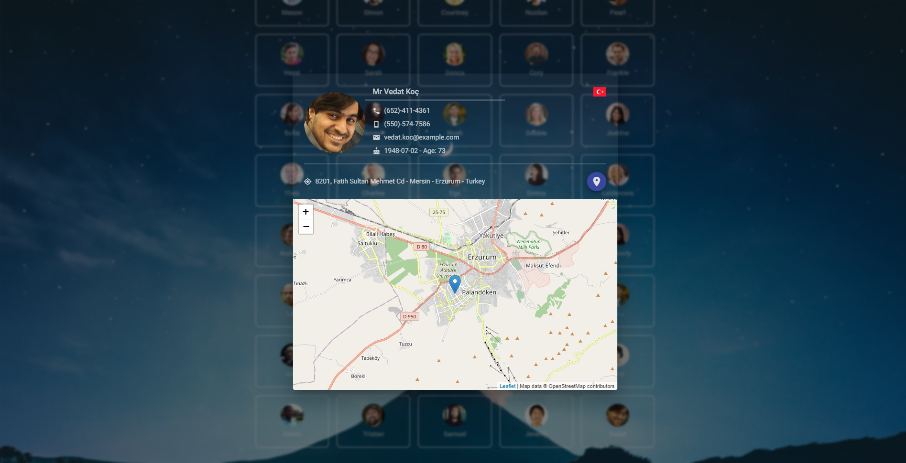

# RandomUser

<div style="display: flex; column-gap: 10px">
  
  
  
</div>

## Tecnologias
Projeto criado para estudo da linguagem angular.
  - [x] Angular
  - [x] Typescript
  - [x] Consumo API
  - [x] Mapa Leaflet 

#### Para rodar o projeto:

```shell
git clone https://github.com/vscolasanto/random-user.git
```
```shell
cd random-user
```
```shell
npm install
```
```shell
ng s
```

Após o clone e instalação das dependências, execute o projeto com `ng s`. O projeto será disponibilizado no endereço `http://localhost:4200`.
